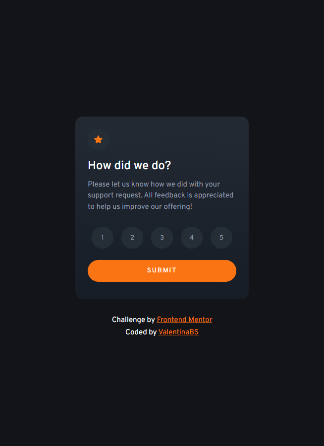
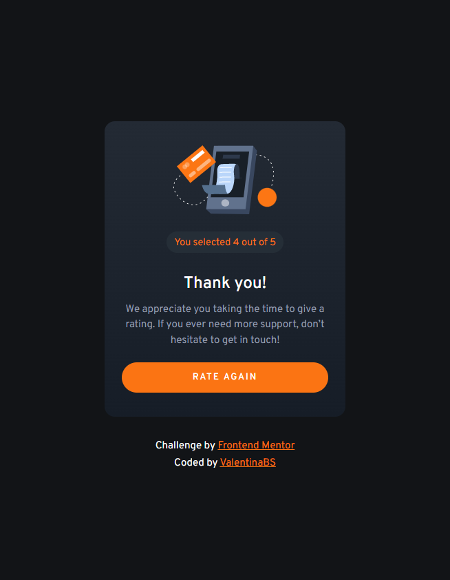

# Frontend Mentor - Interactive rating component solution

This is a solution to the [Interactive rating component challenge on Frontend Mentor](https://www.frontendmentor.io/challenges/interactive-rating-component-koxpeBUmI). I added some extra features, like a "Rate Again" button, and a warning message in case you didn't press any buttons before submitting.

## Table of contents

- [The challenge](#the-challenge)
- [Screenshots](#screenshots)
- [Links](#links)
- [Built with](#built-with)
- [Author](#author)

## The challenge

Users should be able to:

- View the optimal layout for the app depending on their device's screen size
- See hover states for all interactive elements on the page
- Select and submit a number rating
- See the "Thank you" card state after submitting a rating

## Screenshots

My results (responsiveness included!) 

Project preview

## Links

- Solution URL: [Solution in Frontend Mentor](https://www.frontendmentor.io/solutions/rating-component-with-html-and-scss-with-input-warning-iA9O_BQp0c)
- Live Site URL: [Vercel Deploy](https://interactive-rating-component-sooty-one.vercel.app/)

## Built with

- Semantic HTML5 markup
- CSS custom properties
- Flexbox
- JavaScript
- Mobile-first workflow
- [Sass](https://sass-lang.com/) - For styles

## Author

- Frontend Mentor - [@ValentinaBS](https://www.frontendmentor.io/profile/ValentinaBS)
- Github - [@ValentinaBS](https://github.com/ValentinaBS)